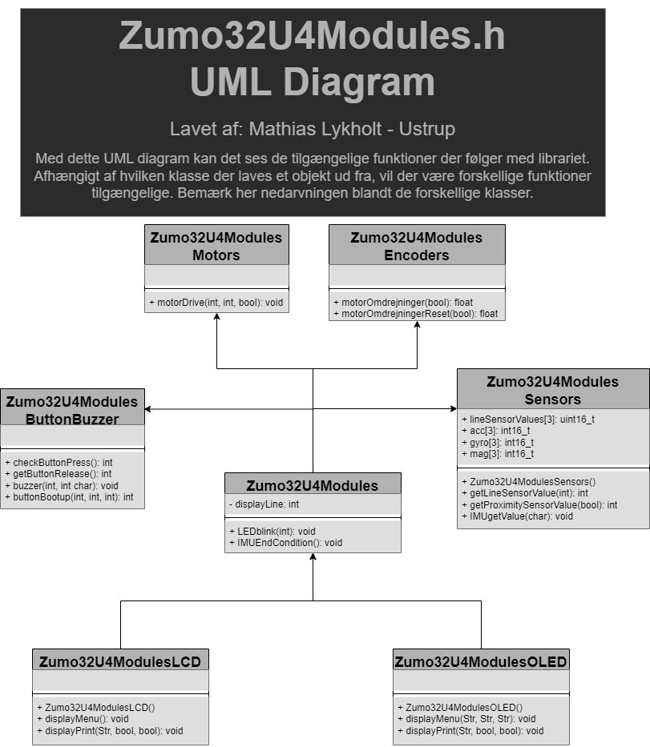

# TO-DO LIST
* Make library and GitHub repository fully translated to english
* Make use of OLED display graphics functionality (Currently limited to text)

# Indholdsfortegnelse
+ [Zumo32U4Modules](https://github.com/SaltworkerMLU/Zumo32U4Modules/edit/main/README.md#zumo32u4modules)
+ [Zumo32U4Modules.h](https://github.com/SaltworkerMLU/Zumo32U4Modules/tree/main#Zumo32u4modulesh)
+ [Get started](https://github.com/SaltworkerMLU/Zumo32U4Modules/tree/main#Get-started)
  + [Method A](https://github.com/SaltworkerMLU/Zumo32U4Modules/edit/main/README.md#get-started)
  + [Method B](https://github.com/SaltworkerMLU/Zumo32U4Modules/edit/main/README.md#get-started)

# Zumo32U4Modules


Et library beregnet til at gøre programmeringen af en Zumo32U4 hurtigere og nemmere. Dvs. at man med librariet ikke behøver at 
* inkludere <Zumo32U.h> & <Wire.h>
* konstruere objekter beregnet til de respektive komponenter
* setup sensorer som kræver yderligere mén
* foretage handlinger med sagte komponenter

# Zumo32U4Modules.h
Her vises librariet Zumo32U4Modules.h med næsten ingen kommentarer
``` 
#ifndef Zumo32U4Modules_h   /* Denne linje kommer altid først i en header fil */

#include <Arduino.h>  // En header fil, oprindeligt fra C, påkræver librariet som gør .ino hvad det er.
#include <Wire.h>     // Zumo32U4.h er afhængig af følgende library
#include <Zumo32U4.h> // Tilgå Zumo32U4.h library her: https://pololu.github.io/zumo-32u4-arduino-library/

class Zumo32U4ModulesButtonBuzzer : protected Zumo32U4ButtonA, 
                                    protected Zumo32U4ButtonB,
                                    protected Zumo32U4ButtonC, 
                                    protected Zumo32U4Buzzer { 
public: 
  int checkButtonPress();
  int getButtonRelease();
  void buzzer(int freq=400, int duration=50, char volume=10) { playFrequency(freq, duration, volume); }
  int buttonBootup(int attention=10, int windup=800, int freq=400); 
};

class Zumo32U4ModulesMotors : protected Zumo32U4Motors { 
public: 
  void motorDrive(int left=0, int right=0, bool bakgear=false); 
};

class Zumo32U4ModulesEncoders : protected Zumo32U4Encoders { 
public: 
  float motorOmdrejninger(bool index);
  float motorOmdrejningerReset(bool index);
};

class Zumo32U4ModulesSensors :  protected Zumo32U4ProximitySensors,
                                protected Zumo32U4LineSensors, 
                                protected Zumo32U4IMU {
public:
  uint16_t lineSensorValues[3];
  int16_t* acc[3] = {&a.x, &a.y, &a.z}; 
  int16_t* gyro[3] = {&g.x, &g.y, &g.z};
  int16_t* mag[3] = {&m.x, &m.y, &m.z};
  Zumo32U4ModulesSensors();
  int getProximitySensorValue(bool index);
  int getLineSensorValue(int index=-1);
  int16_t getIMUValue(char mag='_');
};

class Zumo32U4Modules : public Zumo32U4ModulesButtonBuzzer, 
                        public Zumo32U4ModulesMotors, 
                        public Zumo32U4ModulesEncoders, 
                        public Zumo32U4ModulesSensors
{
protected:
  int displayLine = 0; // Bruges eksklusivt til class Zumo32U4ModulesLCD & class Zumo32U4ModulesOLED
public:
  void LEDblink(int interval); 
  void IMUEndCondition();
};

class Zumo32U4ModulesLCD : public Zumo32U4Modules, protected Zumo32U4LCD {
public:
  Zumo32U4ModulesLCD();
  void displayMenu();
  void displayPrint(String input, uint8_t X=0, bool newLine=false, bool clear=false);
};

class Zumo32U4ModulesOLED : public Zumo32U4Modules, protected Zumo32U4OLED {
public:
  Zumo32U4ModulesOLED();
  void displayMenu();
  void displayPrint(String input, uint8_t X=0, bool newLine=false, bool clear=false);
};

#endif // Denne linje kommer altid sidst i en header fil
```
(Zumo32U4Modules.h sidst opdateret: 24. september 2023)

# Get Started
There are 2 ways to use an Arduino library:
## A. Download Zip to Arduino IDE
1.  Download ZIP folder of Zumo32U4Modules
2.  Open Arduino IDE
3.  Add the downloaded ZIP to your libraries


Zumo32U4Modules can now be imported by using #include <Zumo32U4Modules.h>
## B. Insert Zumo32U4Modules.cpp & Zumo32U4Modules.h directly into own Arduino project/sketch
1.  Download ZIP folder of Zumo32U4Modules
2.  Like the title says, extract ZIP folder to your current Arduino project/sketch
   
Zumo32U4Modules can then be imported by using #include "Zumo32U4Modules.h"
