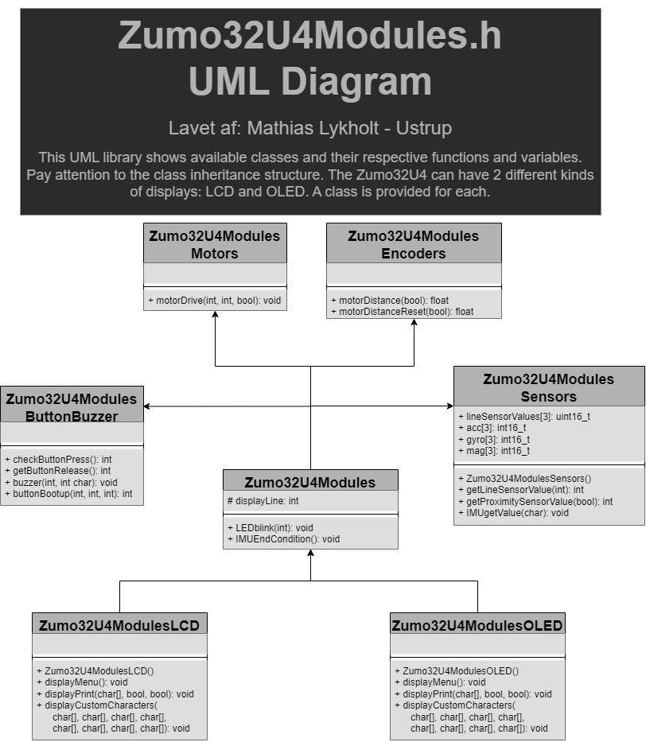
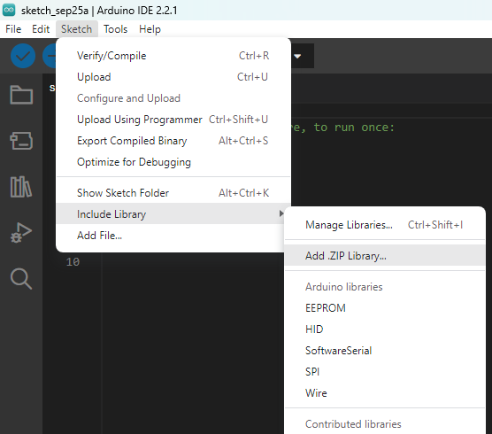

# WORK IN PROGRESS
* Make use of OLED display graphics functionality (Currently limited to text)
* Add more sophisticated functions
* Additional changes/simplifications to library may occur

# Table of contents
+ [Zumo32U4Modules](https://github.com/SaltworkerMLU/Zumo32U4Modules/tree/main#zumo32u4modules)
+ [Zumo32U4Modules.h](https://github.com/SaltworkerMLU/Zumo32U4Modules/tree/main#zumo32u4modulesh)
+ [Get started](https://github.com/SaltworkerMLU/Zumo32U4Modules/tree/main#get-started)
  + [Method A: Download Zip with Arduino IDE](https://github.com/SaltworkerMLU/Zumo32U4Modules/tree/main#a-download-zip-with-arduino-ide)
  + [Method B: Manual insertion of extracted ZIP folder to Arduino sketch](https://github.com/SaltworkerMLU/Zumo32U4Modules/tree/main#b-manual-insertion-of-extracted-zip-folder-to-arduino-sketch)

# Zumo32U4Modules
Simplify the programming process of your comming Zumo32U4 project. Just import this library, create the nessecary object(s), and you're good to go to use the components in accordance to constructed object(s).



Furthermore, this library imports the library "Zumo32U4.h" which has the following functions outside of any classes therefore also accessible in this library attached:
* ledRed(bool)
* ledYellow(bool)
* ledGreen(bool)
* readBatteryMillivolts(): int
* isPowerPresent(): bool // is the Zumo32U4 connected to another device, e.g. computer, via. USB cable?

The fact that the library "Zumo32U4.h" is imported also means you still can create objects of the ordinary Zumo32U4 classes alongside Zumo32U4Modules classes.
# Zumo32U4Modules.h
Here is "Zumo32U4Modules.h" with almost no comments to shorten it.
``` 
#ifndef Zumo32U4Modules_h   // This line always comes first in a header file

#include <Arduino.h>  // A header file, originally from C, required the library that makes .ino what it is.
#include <Wire.h>     // Zumo32U4.h depends on this library to function properly
#include <Zumo32U4.h> // Access Zumo32U4.h library here: https://pololu.github.io/zumo-32u4-arduino-library/

class Zumo32U4ModulesButtons : protected Zumo32U4ButtonA, 
                                    protected Zumo32U4ButtonB,
                                    protected Zumo32U4ButtonC { 
public: 
  int checkButtonPress();
  int getButtonRelease();
  int buttonBootup(int windup=800); 
};

class Zumo32U4ModulesBuzzer : public Zumo32U4Buzzer { // Imports Zumo32U4Buzzer for direct use in .ino file
public:
  void buzzer(int frequency=400, int duration=50, int volume=10);
};

class Zumo32U4ModulesMotors : protected Zumo32U4Motors { 
public: 
  void motorDrive(int left=0, int right=0, bool reverse=false); 
};
class Zumo32U4ModulesEncoders : protected Zumo32U4Encoders { 
private:
  long oldTime[2]; // Old time for both encoders
  float oldDistance[2]; // Old distance for both encoders
public: 
  float motorVelocity[2];
  float motorAcceleration[2];
  int CPR=900;

  float motorDistance(bool index);
  float motorDistanceReset(bool index);
  void getMotorVelocity();
  void getMotorAcceleration();
};

class Zumo32U4ModulesLineSensors : protected Zumo32U4LineSensors {
public:
  uint16_t lineSensorValues[3];

  Zumo32U4ModulesLineSensors();
  void getLineSensorValue();
};

class Zumo32U4ModulesProximitySensors : protected Zumo32U4ProximitySensors {
public:
  Zumo32U4ModulesProximitySensors();
  int getProximitySensorValue(bool index);
};

class Zumo32U4ModulesIMU : protected Zumo32U4IMU {
public:
  int16_t* mag[3] = {&m.x, &m.y, &m.z};
  int16_t* acc[3] = {&a.x, &a.y, &a.z}; 
  int16_t* gyro[3] = {&g.x, &g.y, &g.z};
  int16_t gyroOffset;  // When gyro[index] = gyroOffset: No change in angle
  uint16_t LastUpdate; // Earlier measurement of time with micros(). "Old time"
  uint32_t turnAngle = 0; // Current calibrated angle of Zumo32U4

  void initIMU();
  int16_t getIMUvalue(char m_a_g='_');
  int16_t calibrate(char m_a_g, int index, int iterations=1000); // EXPERIMENTAL
  int32_t dAngle(int index); // EXPERIMENTAL
};

class Zumo32U4Modules : public Zumo32U4ModulesButtons, 
                        public Zumo32U4ModulesBuzzer,
                        public Zumo32U4ModulesMotors, 
                        public Zumo32U4ModulesEncoders, 
                        public Zumo32U4ModulesLineSensors,
                        public Zumo32U4ModulesProximitySensors,
                        public Zumo32U4ModulesIMU {
public:
  int displayLine = 0; // Exclusively used for class Zumo32U4ModulesLCD & class Zumo32U4ModulesOLED

  int buttonBootupSound(int windup=800, int attention=10); 
  void LEDblink(int interval); 
  void IMUEndCondition();
};

class Zumo32U4ModulesLCD : public Zumo32U4Modules, protected Zumo32U4LCD {
public:
  Zumo32U4ModulesLCD();
  void displayMenu();
  void displayPrint(String input, bool clear=false, bool newLine=true); // Example: LCDprint("Hello World!");
  void displayCustomCharacters(char custom1[]={}, char custom2[]={}, char custom3[]={}, char custom4[]={}, 
                               char custom5[]={}, char custom6[]={}, char custom7[]={}, char custom8[]={});
};

class Zumo32U4ModulesOLED : public Zumo32U4Modules, protected Zumo32U4OLED {
public:
  Zumo32U4ModulesOLED();
  void displayMenu();
  void displayPrint(String input, bool clear=false, bool newLine=true); // Eksempel: OLEDprint("Hello World!");
  void displayCustomCharacters(char custom1[]={}, char custom2[]={}, char custom3[]={}, char custom4[]={}, 
                               char custom5[]={}, char custom6[]={}, char custom7[]={}, char custom8[]={});
};

const char backArrow[] PROGMEM = {0, 2, 1, 5, 9, 30, 8, 4};
const char backArrowReverse[] PROGMEM = {0, 8, 16, 20, 18, 15, 2, 4};
const char forwardArrows[] PROGMEM = {0, 4, 10, 17, 4, 10, 17, 0};
const char reverseArrows[] PROGMEM = {0, 17, 10, 4, 17, 10, 4, 0};
const char forwardArrowsSolid[] PROGMEM = {0, 4, 14, 31, 4, 14, 31, 0};
const char reverseArrowsSolid[] PROGMEM = {0, 31, 14, 4, 31, 14, 4, 0};
const char rightArrow[] PROGMEM = {8, 12, 14, 15, 14, 12, 8, 0};
const char leftArrow[] PROGMEM = {2, 6, 14, 30, 14, 6, 2, 0};

#endif // This line always comes last in a header file
```
("Zumo32U4Modules.h" last updated: 19. October 2023)

# Get Started
First off, open Arduino IDE. Here, open File\Preferences and under "Additional board manager URLs" insert the following link:

https://files.pololu.com/arduino/package_pololu_index.json

Doing so, you will be able to find the library Zumo32U4 under library manager. Installing it will be essential for Zumo32U4Modules to function.

To install and use Zumo32U4Modules, here are 2 methods provided:
## A: Download Zip with Arduino IDE
1.  Download ZIP folder of Zumo32U4Modules
2.  Open Arduino IDE
3.  Add the downloaded ZIP to your libraries



Zumo32U4Modules can now be imported by using #include <Zumo32U4Modules.h>
## B: Manual insertion of extracted ZIP folder to Arduino sketch
1.  Download ZIP folder of Zumo32U4Modules
2.  Like the title says, extract ZIP folder to your current Arduino sketch
   
Zumo32U4Modules can then be imported by using #include "Zumo32U4Modules.h"
