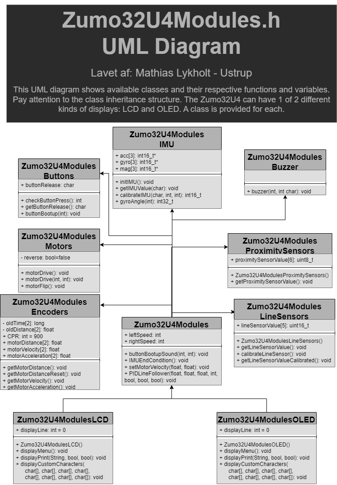

# TO-DO LIST
* Make use of OLED display graphics functionality (Currently limited to text)

# Table of contents
+ [Zumo32U4Modules](https://github.com/SaltworkerMLU/Zumo32U4Modules/tree/main#zumo32u4modules)
+ [Zumo32U4Modules.h](https://github.com/SaltworkerMLU/Zumo32U4Modules/tree/main#zumo32u4modulesh)
+ [Get started](https://github.com/SaltworkerMLU/Zumo32U4Modules/tree/main#get-started)
  + [Method A: Download Zip with Arduino IDE](https://github.com/SaltworkerMLU/Zumo32U4Modules/tree/main#a-download-zip-with-arduino-ide)
  + [Method B: Manual insertion of extracted ZIP folder to Arduino sketch](https://github.com/SaltworkerMLU/Zumo32U4Modules/tree/main#b-manual-insertion-of-extracted-zip-folder-to-arduino-sketch)

# Zumo32U4Modules
Simplify the programming process of your comming Zumo32U4 project. Just import this library, create the nessecary object(s), and you're good to go to use the components in accordance to constructed object(s).



Furthermore, this library imports the library "Zumo32U4.h" which has the following functions outside of any classes therefore also accessible in this library attached:
* ledRed(bool)
* ledYellow(bool)
* ledGreen(bool)
* readBatteryMillivolts(): int
* isPowerPresent(): bool // is the Zumo32U4 connected to another device, e.g. computer, via. USB cable?

The fact that the library "Zumo32U4.h" is imported also means you still can create objects of the ordinary Zumo32U4 classes alongside Zumo32U4Modules classes.
# Zumo32U4Modules.h
Here is "Zumo32U4Modules.h" with almost no comments to shorten it (excluding display custom characters).
``` 
#ifndef Zumo32U4Modules_h   /* This line always comes first in a header file */

#include <Arduino.h>  // A header file, originally from C, required the library that makes .ino what it is.
#include <Wire.h>     // Zumo32U4.h depends on this library to function properly
#include <Zumo32U4.h> // Access Zumo32U4.h library here: https://pololu.github.io/zumo-32u4-arduino-library/

class Zumo32U4ModulesButtonBuzzer : protected Zumo32U4ButtonA, 
                                    protected Zumo32U4ButtonB,
                                    protected Zumo32U4ButtonC, 
                                    protected Zumo32U4Buzzer { 
public: 
  int checkButtonPress();
  int getButtonRelease();
  void buzzer(int frequency=400, int duration=50, int volume=10);
  int buttonBootup(int attention=10, int windup=800);
};

class Zumo32U4ModulesMotors : protected Zumo32U4Motors { 
public: 
  void motorDrive(int left=0, int right=0, bool reverse=false); 
};

class Zumo32U4ModulesEncoders : protected Zumo32U4Encoders { 
public: 
  float motorDistance(bool index);
  float motorDistanceReset(bool index);
};

class Zumo32U4ModulesSensors :  protected Zumo32U4ProximitySensors,
                                protected Zumo32U4LineSensors, 
                                protected Zumo32U4IMU {
public:
  uint16_t lineSensorValues[3];
  int16_t* mag[3] = {&m.x, &m.y, &m.z};
  int16_t* acc[3] = {&a.x, &a.y, &a.z}; 
  int16_t* gyro[3] = {&g.x, &g.y, &g.z};
  int16_t gyroOffset;  // When gyro[index] = gyroOffset: No change in angle
  uint16_t LastUpdate; // Earlier measurement of time with micros(). "Old time"
  uint32_t turnAngle = 0; // Current calibrated angle of Zumo32U4

  Zumo32U4ModulesSensors();
  int getProximitySensorValue(bool index);
  int getLineSensorValue(int index=-1);
  int16_t getIMUvalue(char m_a_g='_');
  int16_t calibrate(char m_a_g, int index, int iterations=1000); // EXPERIMENTAL
  uint32_t dAngle(int index); // EXPERIMENTAL
};

class Zumo32U4Modules : public Zumo32U4ModulesButtonBuzzer, 
                        public Zumo32U4ModulesMotors, 
                        public Zumo32U4ModulesEncoders, 
                        public Zumo32U4ModulesSensors {
public:
  int displayLine = 0; // Exclusively used for class Zumo32U4ModulesLCD & class Zumo32U4ModulesOLED
  
  void LEDblink(int interval); 
  void IMUEndCondition();
};

class Zumo32U4ModulesLCD : public Zumo32U4Modules, protected Zumo32U4LCD {
public:
  Zumo32U4ModulesLCD();
  void displayMenu();
  void displayPrint(char input[], bool clear=false, bool newLine=true); // Example: LCDprint("Hello World!");
  void displayCustomCharacters(char custom1[]={}, char custom2[]={}, char custom3[]={}, char custom4[]={}, 
                               char custom5[]={}, char custom6[]={}, char custom7[]={}, char custom8[]={});
};

class Zumo32U4ModulesOLED : public Zumo32U4Modules, protected Zumo32U4OLED {
public:
  Zumo32U4ModulesOLED();
  void displayMenu();
  void displayPrint(char input[], bool clear=false, bool newLine=true); // Eksempel: OLEDprint("Hello World!");
  void displayCustomCharacters(char custom1[]={}, char custom2[]={}, char custom3[]={}, char custom4[]={}, 
                               char custom5[]={}, char custom6[]={}, char custom7[]={}, char custom8[]={});
};

#endif // This line always comes last in a header file
```
("Zumo32U4Modules.h" last updated: 4. October 2023)

# Get Started
There are 2 ways to use an Arduino library:
## A: Download Zip with Arduino IDE
1.  Download ZIP folder of Zumo32U4Modules
2.  Open Arduino IDE
3.  Add the downloaded ZIP to your libraries


Zumo32U4Modules can now be imported by using #include <Zumo32U4Modules.h>
## B: Manual insertion of extracted ZIP folder to Arduino sketch
1.  Download ZIP folder of Zumo32U4Modules
2.  Like the title says, extract ZIP folder to your current Arduino sketch
   
Zumo32U4Modules can then be imported by using #include "Zumo32U4Modules.h"
